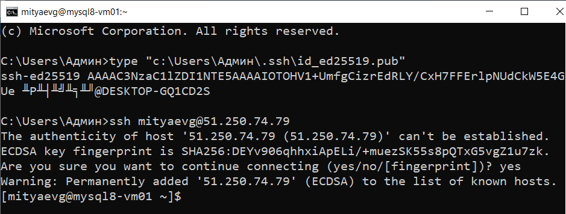
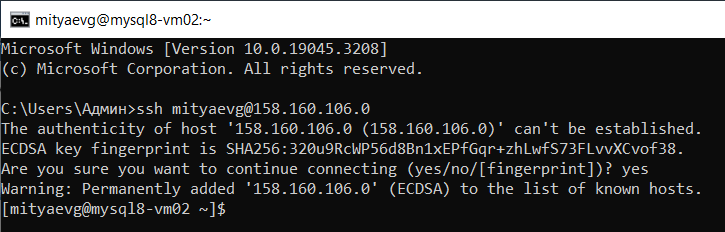

# Домашнее задание к занятию «Репликация и масштабирование. Часть 1»

### Задание 1

На лекции рассматривались режимы репликации master-slave, master-master, опишите их различия.

*Ответить в свободной форме.*

**Ответ:**

В модели репликации **master - slave** существует только одна основная база данных (master-db) и несколько второстепенных
баз данных (slave-dbs). Операции записи данных могут производиться только в отношении master-db, а операции чтения - как 
с master-db, так и со slave-dbs. Обновления slave-dbs происходят из master-db, что обеспечивает целостность данных между
репликами. 

При падении одной из slave-dbs и последующем восстановлении работоспособности, происходит достаточно быстрая
пересинхронизация данных из основной базы. 

При падении самой master-db, slave-db с наиболее актуальными данными становится master. В случае применения ассинхронной
синхронизации возможны потери данных, т.к. изменения могли не успеть записаться во второстепенные базы вовремя.

Модель **master - slave** лучше использовать в ситуациях, когда операции чтения данных превалируют над операциями записи.   

В модели репликации **master - master**, также известной как **multi-master**, все ноды являются основными. Операции чтения/записи
применимы сразу ко всем базам данных. Каждая БД синхронизирует свои изменения с остальными копиями, что обеспечивает целостность
данных.

Проблемы возникают, когда базы обновляются параллельно. Для обеспечения стабильности используются алгоритмы консенсуса, а также
решения могут приниматься на основе временного штампа обновлений.

Модель **master - master** чаще используется в критически важных системах храненения данных, там где происходит большое количество
операций записи данных.

---

### Задание 2

Выполните конфигурацию master-slave репликации, примером можно пользоваться из лекции.

*Приложите скриншоты конфигурации, выполнения работы: состояния и режимы работы серверов.*

**Решение:**

- Руководствуясь материалом из лекции, создадим 2 ВМ под управлением **CentOS 7** в **Yandex.Cloud**:
```
mysql8-vm01
mysql8-vm02
```

<kbd></kbd>

- Подключимся по SSH к виртуальным машинам:

<kbd></kbd>

<kbd></kbd>

- Переключимся на **root**:
```
[mityaevg@mysql8-vm01 ~]$ sudo su -
[root@mysql8-vm01 ~]#
```
```
[mityaevg@mysql8-vm02 ~]$ sudo su -
[root@mysql8-vm02 ~]#
```
- Добавим **gpg-ключ** в систему:
```
rpm --import https://repo.mysql.com/RPM-GPG-KEY-mysql-2022
```
- Добавим репозиторий msql 8.0:
```
rpm -Uvh https://dev.mysql.com/get/mysql80-community-release-el7-6.noarch.rpm
```
- Установим компоненты **mysql-server** и **mysql-client**:
```
yum -y install mysql-server mysql-client
```
- Создадим журнал для записи логов базы данных:
```
mkdir -p /var/log/mysql
```
- Инициализируем наши серверы:
```
mysqld --initialize
```
- Проверим журнал **mysqld.log**:
**mysql8-vm01:**
```
cat /var/log/mysqld.log
2023-08-06T18:44:18.025405Z 6 [Note] [MY-010454] [Server] A temporary password is generated for root@localhost: uqkWR,8GqPB5
```
**mysql8-vm02:**
```
cat /var/log/mysqld.log
2023-08-06T18:44:23.889039Z 6 [Note] [MY-010454] [Server] A temporary password is generated for root@localhost: #1fQoislWsk6
```
- Предоставим необходимые права пользователю mysql:
```
chown -R mysql: /var/lib/mysql
chown -R mysql: /var/log/mysql
```
- Приступаем к редактированию конфига:
```
nano /etc/my.cnf
```
- Вносим изменения в раздел **[mysqld]**:

**mysql8-vm01:**
```
[mysqld]
bind-address=0.0.0.0
server-id=1
log_bin=/var/log/mysql/mybin.log
```
**mysql8-vm02:**
```
[mysqld]
bind-address=0.0.0.0
server-id=2
log_bin=/var/log/mysql/mybin.log
```
- Запускаем сервис **mysqld**:
```
systemctl start mysqld
```
- Запускаем консоль mysql на наших серверах:
**mysql8-vm01:**
```
mysql -p
Enter password: uqkWR,8GqPB5
```
**mysql8-vm02:**
mysql -p
Enter password: #1fQoislWsk6
```
