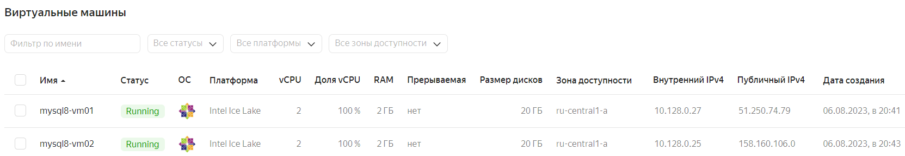

# Домашнее задание к занятию «Репликация и масштабирование. Часть 1»

### Задание 1

На лекции рассматривались режимы репликации master-slave, master-master, опишите их различия.

*Ответить в свободной форме.*

**Ответ:**

В модели репликации **master - slave** существует только одна основная база данных (master-db) и несколько второстепенных
баз данных (slave-dbs). Операции записи данных могут производиться только в отношении master-db, а операции чтения - как 
с master-db, так и со slave-dbs. Обновления slave-dbs происходят из master-db, что обеспечивает целостность данных между
репликами. 

При падении одной из slave-dbs и последующем восстановлении работоспособности, происходит достаточно быстрая
пересинхронизация данных из основной базы. 

При падении самой master-db, slave-db с наиболее актуальными данными становится master. В случае применения ассинхронной
синхронизации возможны потери данных, т.к. изменения могли не успеть записаться во второстепенные базы вовремя.

Модель **master - slave** лучше использовать в ситуациях, когда операции чтения данных превалируют над операциями записи.   

В модели репликации **master - master**, также известной как **multi-master**, все ноды являются основными. Операции чтения/записи
применимы сразу ко всем базам данных. Каждая БД синхронизирует свои изменения с остальными копиями, что обеспечивает целостность
данных.

Проблемы возникают, когда базы обновляются параллельно. Для обеспечения стабильности используются алгоритмы консенсуса, а также
решения могут приниматься на основе временного штампа обновлений.

Модель **master - master** чаще используется в критически важных системах храненения данных, там где происходит большое количество
операций записи данных.

---

### Задание 2

Выполните конфигурацию master-slave репликации, примером можно пользоваться из лекции.

**Решение:**

- Руководствуясь материалом из лекции, создадим 2 ВМ под управлением **CentOS 7** в **Yandex.Cloud**:
```
mysql8-vm01
mysql8-vm02
```

<kbd></kbd>


*Приложите скриншоты конфигурации, выполнения работы: состояния и режимы работы серверов.*
